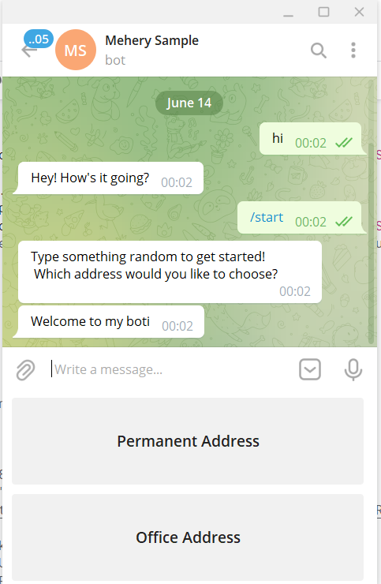
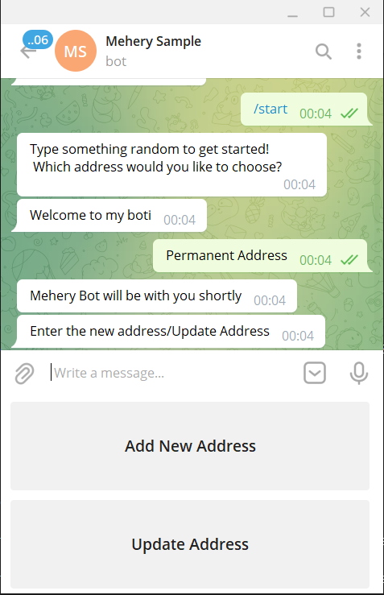
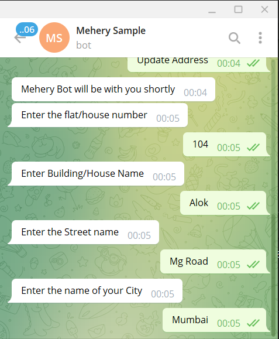
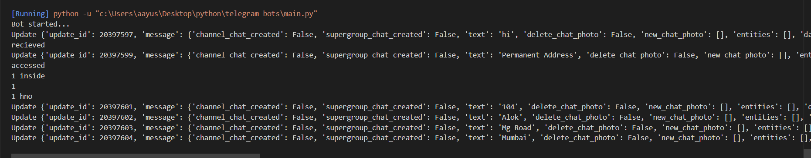

# Sample-telegram-bot
It's a basic telegram bot which updates the users address and stores in a spreadsheet. It uses basic python and app script. No additional tools are required.

## Snapshots

>This is the first page of the bot
>

>There are some hard coded replies and two button choices upon entering the command start
>

>The bot gives you choice
>

>Entering the address
>

>The terminal/console where entries are stored
>
